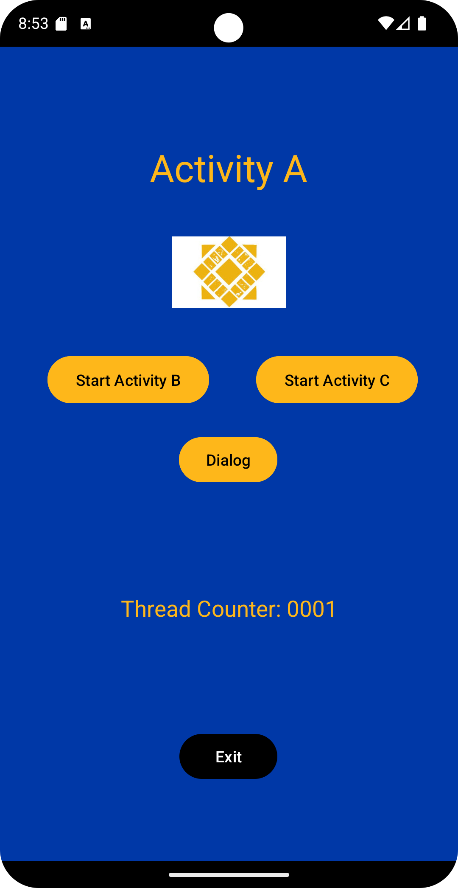
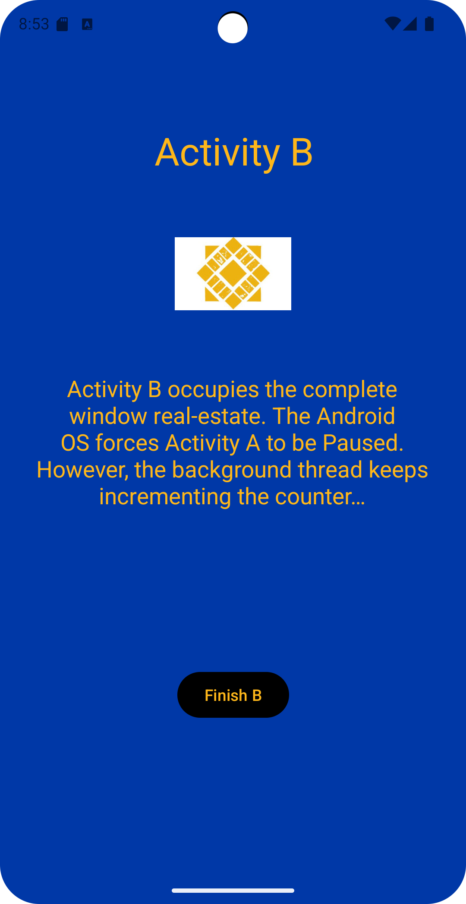
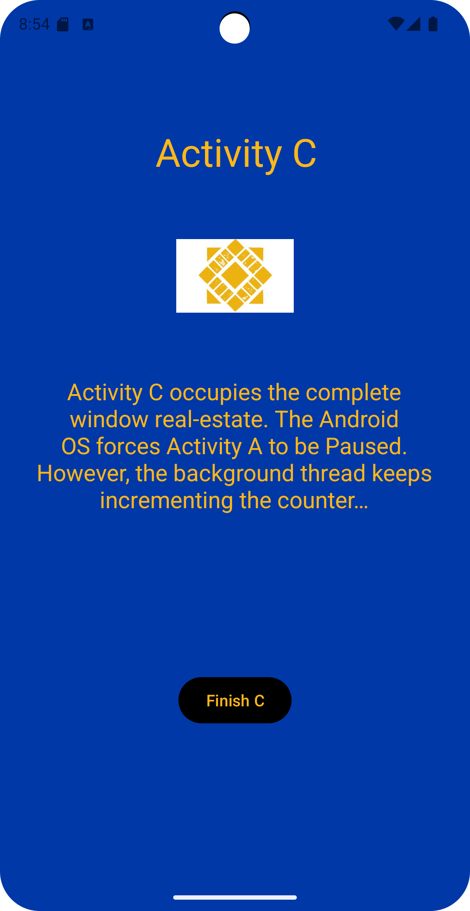
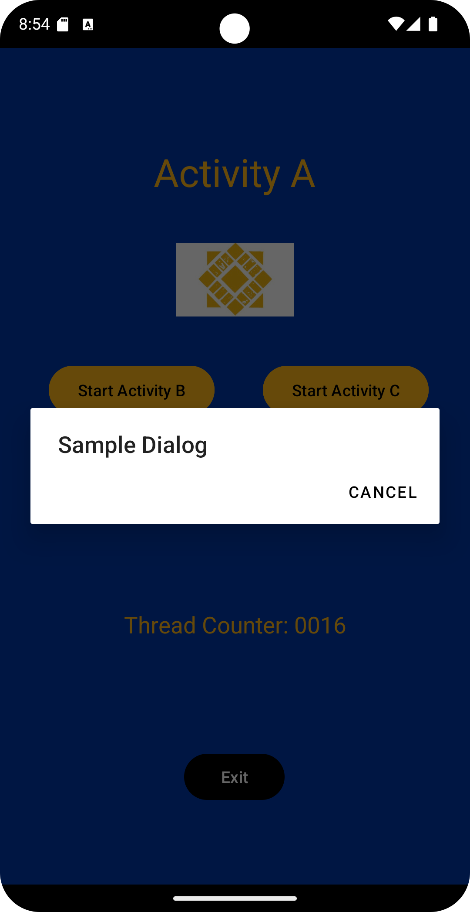
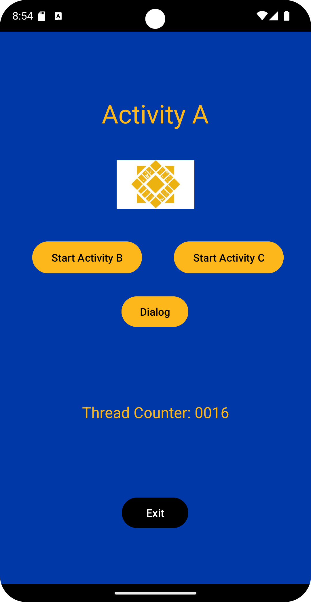

# CMPE277: Assignment 1 - Activity Life Cycle

## Assignment Learning Objective

The purpose of the app is to understand the activity life cycle and the role the Android OS plays in handling life cycle events.

## Screenshots

### Activity A

### Activity B

### Activity C

### Dialog Box

### Thread Counter

## Video Demonstration

[Click here to download or view the video demonstration](./images/video.mp4)
